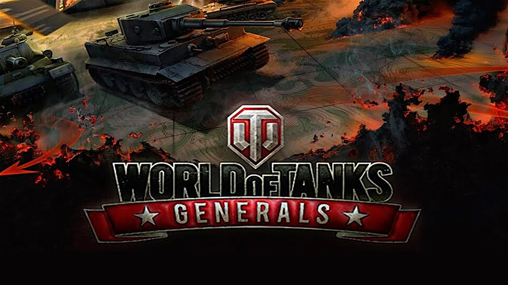
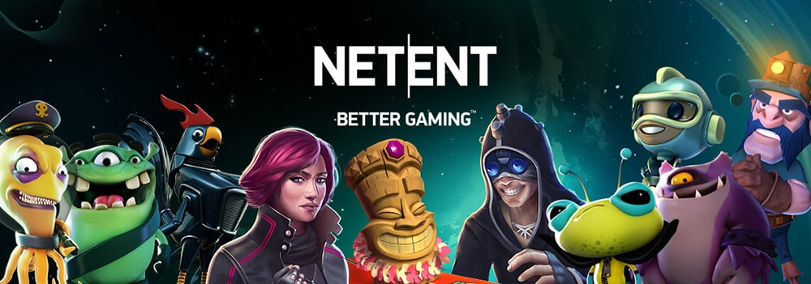
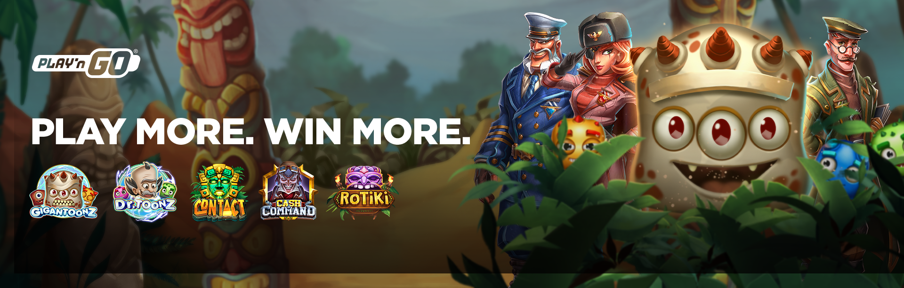

# Work experience

## Logicking

I started to work part-time with my studies in 2012 as a Game Developer for a small web-based game studio, "Logicking".
An innovative, back in the day, company for pioneering HTML5 game development before it became mainstream. They also
had their in-house game engine, which I later on was also developing. There, I introduced the use of canvas rendering into the engine, developed
a few mini-games, and supported a broad portfolio of existing games. You won't find this company online anymore,
as with Russian aggression in Ukraine back in 2014, the founder started to shift his focus into supporting the Ukrainian Army and
volunteering his knowledge and skills to develop software the Army desperately needed to have yesterday. Being young and having
a different experience profile, I eventually moved on.

## Wargaming

In 2014, I joined Persha Studia – a Ukranian-based company owned by Wargaming that was working on World of Warplanes and had
a mobile department working on a mobile and web-based card-collecting game, World of Tanks: Generals. Starting with UI-based tasks
I slowly moved to own the main game mechanics and became the front-end web team lead. The game was based on another 
in-house web-based game engine I had to learn. This experience contributed significantly to my growth as I worked with some
talented developers and a fantastic project manager who introduced me to the Agile framework and Scrum in the most constructive way
possible. I will always appreciate my time there, even though the game was fated for failure. It was released and
featured in the Apple App Store on iOS but showed little traction and closed in a year, with most of us being laid off.

## Vault Zero Games

During my time in Wargaming, I met a few colleagues who decided to start a game development startup around an idea of a mobile hit - a turn-based
game inspired by Heroes of Might and Magic. And I was invited as a Tech Lead, or a main developer, or a CTO if I'd like, and so in 2016
We started developing the game and looking for funding. This became my first acquaintance with Unity3D as we were building the game with it.
Eventually, we decided to start doing out-source game development to fund the development ourselves, but it was never meant to be. We've grown
to a bigger number of employees and rented a small space for the studio, but in the middle of 2017, our group of founders decided to part, and
by redirecting all the clients to other suppliers, we shut down our venture in the most appropriate way possible. But it was an important
experience in my career that taught me a lot, besides the Unity3D and C#.

## NetEnt

Still, at the end of the last venture, I was broke, had some health issues, and needed a stable job fast. My Unity3D and C# experience was not
very impressive at this point, and the variety of job opportunities was also not enticing, so I decided to bet on my Javascript experience. Almost
all my past colleagues went through NetEnt - Kyiv Studio of a Swedish company that is a premium provider of casino games. I wasn't super excited, but the
position of Technical Lead of a Studio with 5 cross-functional teams provided a solid challenge and convenient salary opportunity. Plus, it seemed like a
legitimate company focused on regulated markets, well-known and trusted in the industry. So I bit, and in 2017, I became a Tech Lead at Kyiv Studio of NetEnt.

The experience was indeed a rich one – dealing with a lot of technical debt and engineering frustration, I managed to introduce real changes in terms
of a technical stack and developers' engagement, building trust and empowerment inside the studio. It also introduced me into the world of corporate
processes. I worked a lot with the recruitment of engineers, created a skill matrix for engineers, dealt with rapid studio expansion, and collaborated
with other game studios abroad, including Sweden, where the team owned another in-house game engine we used.

Yet, just before the company was sold to Evolution Gaming, I decided to move on.

## Play'n GO

In early 2021, I received a tempting proposal from Play'n GO for the position of Frontend Game Architect. In my previous company, I tried to solve the technical
task before me – how to make similar to a certain extended games, with increasing productivity and long-term support on multiple platforms in a volatile environment.
And I felt I had an idea, but due to a lot of corporate resistence I didn't manage to implement it. And here I got a request to do exactlty that, officially. So I bit again.

With one minor detail, the position was in Malta. So I also moved to the sunny island of Malta. Not immediatley and not for long, but that's a story for another day.

As a Frontend Game Architect at Play'n GO I work with game developers and engine developers to build a solid technical vision and execute on it, to achieve
high-paced and cost-efficient, sustainable game production through architecture, development of processes and tools, mentorship and coaching, consulting, and even a bit of coding.

Yet this story is still to be summarised.