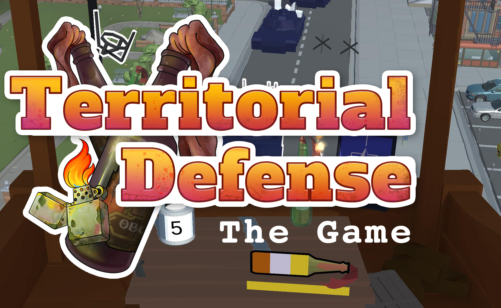

# Territorial Defense: The Game
:::warning
*This project is closed.*
:::

In summer 2022, after the full-scaled Russian invasion in Ukraine, together with my friend and past partner on Stub Games we started to work on the mobile crafting tower defense game. This game wasn't a success, but I still love it. I wrote something like a post-mortem about it in my blog, called [Another Drop in the Ocean](https://notpublicopinion.com/another-drop-in-the-ocean/).

<iframe height="480" width="100%" src="https://www.youtube.com/embed/v7CTKkTTCyo?si=Rx2H7mdQKAsU5zE1" title="YouTube video player" frameborder="0" allow="accelerometer; autoplay; clipboard-write; encrypted-media; gyroscope; picture-in-picture; web-share" referrerpolicy="strict-origin-when-cross-origin" allowfullscreen></iframe>

It was released on iOS (already dropped), Android (already dropped) and itch.io ([available installer for Windows](https://glukozavr.itch.io/territorial-defense-the-game)).
