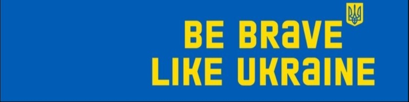

# What is Ukraine?

Ukraine is a country in the eastern part of Europe, independent since 1991. It has a rich history, full of tragedy and struggle. But through the centuries, it kept its idea of being one people taking root from the Kyivan Rus (or the Kingdom of Ruthenia) through the Polish-Lithuanian Commonwealth, Polish Kingdom, Austro-Hungarian Empire, Russian Empire, and the Soviet Union, fighting for the right to be ourselves with the most famous occurrence in recent history before today known as the Cossack Hetmanate, which was eventually torn apart between the Polish Kingdom and Moscovian Tsarsdom, which lead to the beginning of the myth of Russian Empire.

Today, Ukraine is a modern country with a high level of education, famous not only for its grain but also for its developed IT industry and digital innovation. As a young democracy, we face many challenges, but we want to establish our place among other independent democratic countries in Europe through association with the European Union with the intention to join.

# Why am I talking about?

*The city of Toretsk in the Donetsk region was turned into ruins by Russia’s military aggression. July 2024. Photo: Kostiantyn and Vlada Liberov*

In 2014, the Russian Federation started a war against Ukraine by occupying Crimea and invading the east of Ukraine. In 2022, it started a full-scale assault on the capital with the intent to occupy the entire country. While the world watched silently at Russian atrocities in Ukraine and estimated for Ukraine to hold less than a few days, we fought back, and we fight till today. Every day, the country is being bombed, and the Russian army is trying to occupy more land and kill more Ukrainians, committing crimes against humanity every single day.

As good as people in the Baltic Countries (Lithuania, Latvia, Estonia), Poland, and other countries in the east of Europe, we know what happens when Russia wins and occupies you. It's never the end of the war – it's the beginning of the worst but hidden part of it. Internal cleansing, mass deportations, and repressions. 

We can't lose because it would mean death. It's not about a dispute—it's about survival.

# What am I asking of you?

For many reasons, many of which are consequences of direct Russian hybrid aggression with involvement of manipulating our Western allies, but some were also consequences of our own naivete and immaturity, Ukraine is not capable of fighting Russia alone. We rely heavily on aid from other countries, including weapons, financial aid, humanitarian aid, and political aid.

You, as an individual, can support Ukraine in a few ways:

* **Political**. Support politicians who support Ukraine. Or avoid supporting those who don't.
* **Financial**. Donate money to the cause. The most popular and trusted fund is [Come Back Alive](https://savelife.in.ua/en/). You can choose to support the fund for humanitarian aid only if you don't feel comfortable donating for military support.
* **Social**. A lot of Ukrainians spread all over the world as refugees. Some have lost their homes; some are too afraid to stay. Be kind; we are all traumatized, even if we don't show it.
