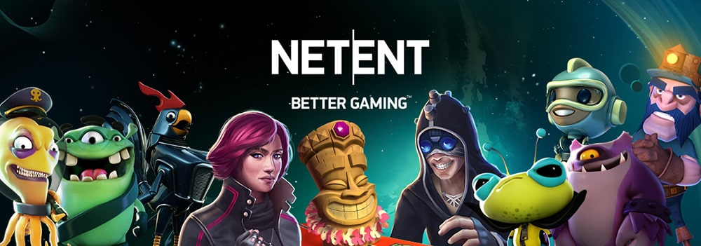

# Досвід роботи

## Logicking

Я почав працювати на пів-ставки під час навчання в 2012 році як розробник ігор для невеликої веб-студії "Logicking".
Інноваційна, на той час, компанія, що почала робити ігри HTML5, до того, як це стало мейнстрімом. Ми також
мали свій власний двіжок для розробки, який я пізніше також розробляв. Я додав підтримку canvas в двіжок,
розробив кілька міні-ігор і підтримував широкий портфель існуючих ігор. Цю компанію ви вже не знайдете в Інтернеті,
оскільки з початком російської агресії в Україні в 2014 році, засновник почав переводити свою увагу на підтримку української армії та
волонтерство, почавши розробку програмного забезпечення для армії. Бувши молодим і маючи профіль, я, врешті-решт, пішов далі.

## Wargaming

У 2014 році я приєднався до Persha Studia – української компанії, що належить Wargaming. Вона відома тим, що працювала над World of Warplanes.
Також мала відділ розробки мобільних ігор, який працював над мобільною та веб-грою, World of Tanks: Generals - коллекційна карткова гра.
Почавши з завдань, пов'язаних з інтерфейсом користувача, я повільно перейшов до основних механік гри і став лідом команди фронт-енду для веба.
Гра базувалася на ігровому двіжку власної розробки, який мені довелося вивчати. Цей досвід значно сприяв моєму зростанню, оскільки я працював з
деякими талановитими розробниками та фантастичним менеджером проєкту, який представив мені Agile-фреймворк та Scrum найбільш конструктивним чином.
Я завжди буду вдячний за свій час там, навіть якщо гра була приречена. Вона була випущена і отримала фічерінг в Apple App Store на iOS, але показала
погані цифри і закрилася через рік. А більшість з нас були звільнені.

## Vault Zero Games

Під час мого перебування в Wargaming я познайомився з декількома колегами, які вирішили створити стартап з розробки ігор навколо ідеї мобільного хіта -
гри пошагової стратегії, натхненної Heroes of Might and Magic. І мене запросили як Tech Lead, або головного розробника, або CTO, якщо я хочу, і так у 2016 році
ми почали розробляти гру та шукати фінансування. Це стало моїм першим знайомством з Unity3D, оскільки ми будували гру на ньому.
Зрештою, ми вирішили почати робити аутсорс розробку ігор, щоб фінансувати розробку самостійно, але не судилося. Ми зросли
до більшої кількості співробітників і орендували невелике приміщення для студії, але в середині 2017 року наша група засновників вирішила розійтися, і
перенаправивши всіх клієнтів до інших постачальників, ми закрили нашу спробу найбільш відповідним чином. Але це був важливий досвід у моїй кар'єрі, який мене багато чому навчив, окрім Unity3D та C#.

## NetEnt

Проте, в кінці цієї пригоди я був на мілі та мав деякі проблеми зі здоров'ям. Тому потребував стабільну роботу і швидко. Мій досвід Unity3D та C# не був
дуже вражаючим на той момент, та й різноманіття можливостей роботи також не було дуже вражаючим, тому я вирішив зробити ставку на свій досвід Javascript. Майже
всі мої колеги пройшли через NetEnt - Київську Студію шведської компанії, яка є преміальним постачальником казино-ігор. Я не був дуже зацікавлений, але посада
Технічного Ліда Студії з 5-тю крос-функціональними командами була солідним викликом та непоганою можливістю заробити. Плюс, виглядало, що це легітимна компанія, яка
спеціалізується на регульованих ринках, добре відома та має авторитет в галузі. Тому я повівся, і в 2017 році став Технічним Лідом в Київській Студії NetEnt.

Досвід був дійсно неоціненним – маючи справу з великою кількістю технічного боргу та зневірʼя серед інженерів, мені вдалося принести реальні зміни в технічному стеку та
залучення розробників, розбудуючи довіру та ініціативність всередині студії. Це також було моє знайомство зі світом корпоративних процесів. Я багато працював з наймом інженерів,
створив матрицю навичок для інженерів, мав справу з швидким розширенням студії та співпрацював з іншими гральними студіями за кордоном, включаючи Швецію,
де команда розробляла ще один ігровий двіжком власного виробництва, який ми використовували.

Проте, саме перед тим, як компанію продали Evolution Gaming, я вирішив йти далі.

## Play'n GO

На початку 2021 року я отримав пропозицію від Play'n GO на посаду Frontend Game Architect. В моїй попередній компанії я намагався вирішити технічну задачу –
як розробляти схожі за структурою ігри, зі зростаючою продуктивністю та довгостроковою підтримкою на багатьох платформах в непостійному середовищі.
І я відчув, що у мене є розуміння, але через корпоративний опір мені так і не вдалося її реалізувати. І ось мені запропонували зробити саме це, офіційно.
Тому я повівся знову.

З однією невеликою деталлю, посада була на Мальті. Тому я також переїхав на сонячний острів Мальта. Не одразу та не на довго, але це історія на інший день.

Як Frontend Game Architect в Play'n GO я працюю з розробниками ігор та розробниками двіжка, щоб розробити технічне бачення для компанії та втілити його, щоб досягти
високошвидкісної та ефективної, стійкої розробки ігор через архітектуру, розробку процесів та інструментів, наставництво та підтримку, консультування, і навіть трохи програмування.

Проте ця історію ще не завершена.
