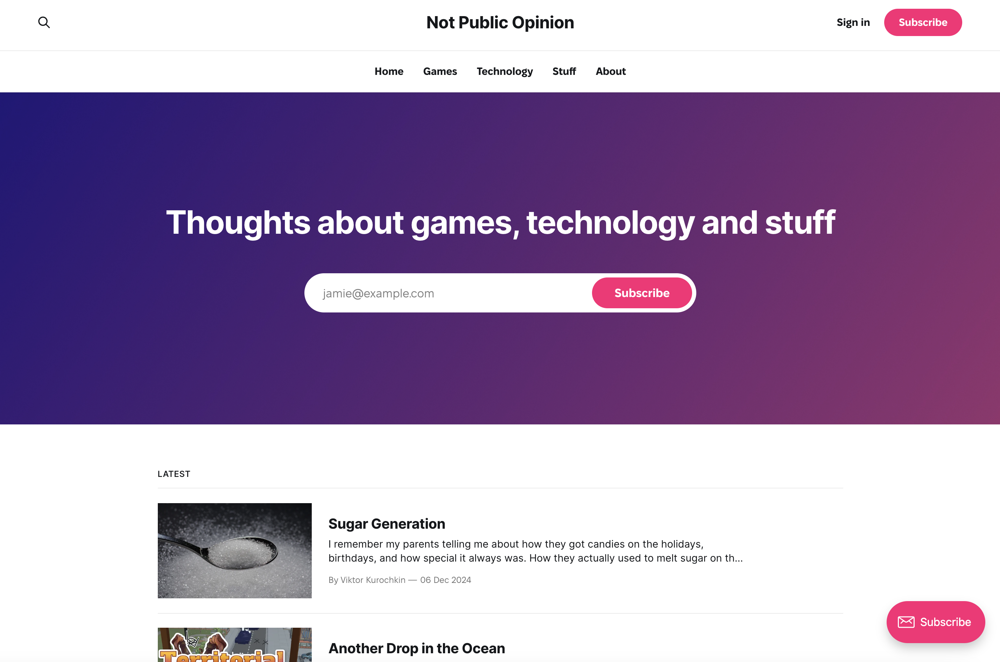

# [Not Public Opinion](https://notpublicopinion.com/)

Я завжди хотів писати, але пропустив час "live journal" (або "жж"), тому ніколи не мав блогу в класичному розумінні.
Я публікував в багатьох місцях, наприклад на [Medium](https://medium.com/@glukozavr) або кілька статей на [LinkedIn](https://www.linkedin.com/in/viktor-kurochkin-gkzr/). 
Але я мав проблеми з вибором того, що писати і де. Моя нерішучість зазвичай призводила до того, що я закидував це діло.
У кінці кінців я знайшов [Ghost](https://ghost.org/) – дуже порядну платформу з правильними цінностями.
І я вирішив створити щось на кшталт блогу там – **Not Public Opinion**.

Сфера блогу широка – ігри, технології та інше. Хоча я думаю і пишу про ігри дуже багато, я також інженер і хочу поділитися своїми
думками про це. Але у мене також є цікаві, нудні або дивні думки про інші речі, якими я теж хочу поділитися.

Я ще не став дуже послідовним у публікаціях, але я вирішив, що всі мої речі будуть там. Якщо вам це цікаво – не соромтеся [підписатися](https://notpublicopinion.com/) і будьте впевнені, що вас не засиплють спамом!

P.S. Лого я створив сам, і воно походить від української назви – Не Суспільна Думка. Спочатку я хотів публікувати англійською та українською,
але врешті-решт я відмовився від цієї ідеї. Але все одно я ділюся періодично частинками української тут і там.
