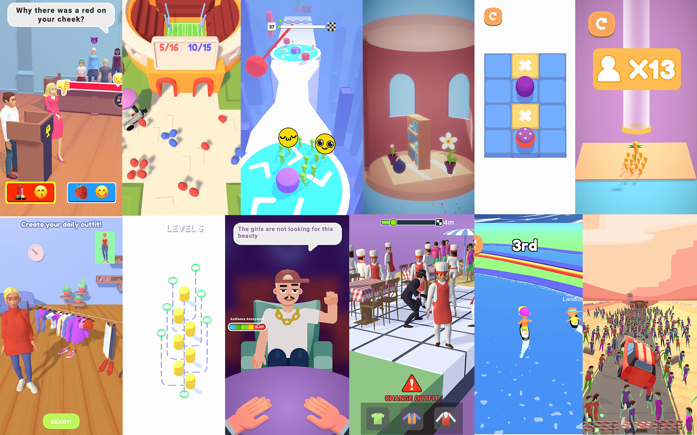

# 

:::warning
*Цей проєкт зупинений.*
:::

В NetEnt я працював з дивовижними людьми. І там я познайомився з парою розробниками, які, як і я, хотіли більшого.
Так що згодом я запропонував розробляти свої ігри разом. І їм сподобалася ідея. Ми вирішили почати з простого проєкту
з коротким терміном, щоб побачити, як спрацюємося. Ми придумали ідею однієї гри, але потім натрапили новину про
геймджем-подію того літа, в 2020 році. Це був гіперказуальний геймджем. Оскільки ми хотіли спробувати працювати разом
і побачити, як це буде на невеликому проєкті, ми погодилися, що це також може бути хорошою можливістю спробувати себе.
Ось як ми побудували Way of Ray - нашу першу гру разом. Ми нічого не виграли.

Це було б все, але з нами зв'язався видавець, щоб протестувати гру на CTR (Click-Through-Rate). І хоча це не принесло нам
жодних коштів – це затягнуло нас в галузь. Ми розібрались з основами гіперказуального ринку і вирішили спробувати. Зробити кілька ігор,
налагодити процес, поліпшити навички з інструментами та отримати шанс заробити гроші для студії. Ось як народився Stub Games.
Ми працювали з цим десь понад рік, побудували 18 прототипів ігор, працювали з 6 видавцями і отримали невеликі гроші в межах різних
домовленостей, але нам ще не вдалося досягти самодостатності. У кінцевому підсумку, я відчув вигорання від роботи над іграми в такому темпі,
та й над іграми, які мене не сильно надихали. Я відчував себе золотокопом, і з відсутністю успіху в перший рік, я вирішив,
що це того не варте.

Проте це була дуже цікава подорож і важливий досвід для мене.

Ви можете переглянути нашу стару презентацію для видавців [тут!](https://docs.google.com/presentation/d/1yDz6M2arVOK_jIrqz9kHj1f6N0z-7npT/edit?usp=sharing&ouid=113946411301170455672&rtpof=true&sd=true)
