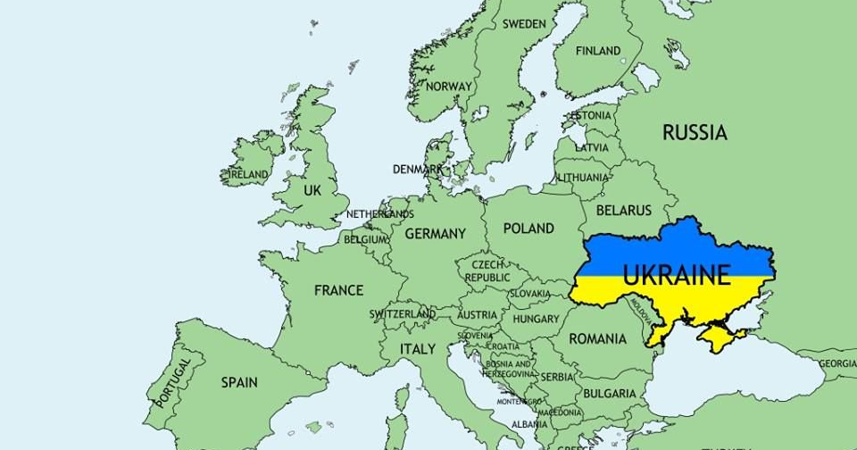
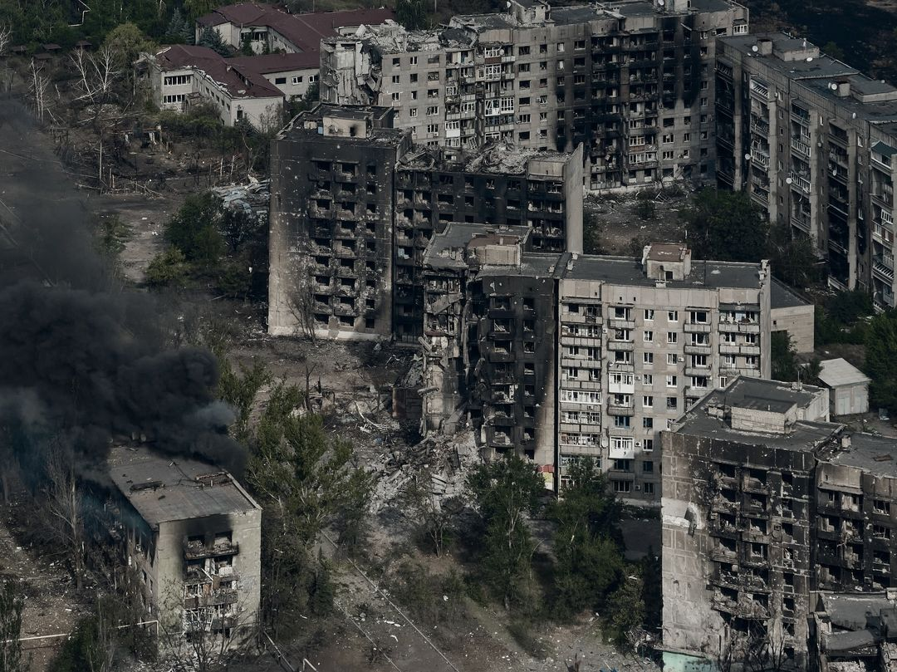
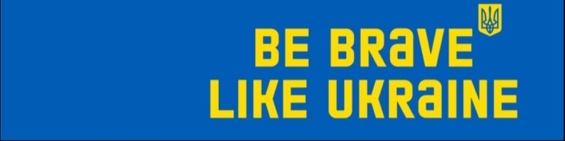

# Що таке Україна?

Україна – це країна на сході Європи, незалежна з 1991 року. У неї багата історія, повна трагедій і боротьби.
Але протягом століть вона зберегла свою ідею єдиного народу, що бере коріння з Київської Русі (або Королівства Русі)
через Річ Посполиту, Польське Королівство, Австро-Угорську імперію, Російську імперію та Радянський Союз,
борючись за право бути собою. Найвідомішим випадком в нашій історії досьогодні є Козацька Гетьманщина, яка врешті-решт
була розірвана між Польським Королівством та Московським Царством, що призвело до початку міфу Російської імперії.

Сьогодні Україна – це сучасна країна з високим рівнем освіти, відома не тільки своїм зерном, але й розвиненою галуззю ІТ
та цифровими інноваціями. Як молода демократія, ми стикаємося з багатьма викликами, але ми хочемо затвердити своє місце серед
інших незалежних демократичних країн Європи через асоціацію з Європейським Союзом з наміром приєднатися.

# Чому я про це говорю?

*Місто Торецьк на Донеччині було перетворено на руїни російською військовою агресією. Липень 2024. Фото: Костянтин і Влада Ліберови*

У 2014 році Російська Федерація розпочала війну проти України, окупувавши Крим та вторгнувшись на схід України.
У 2022 році вона розпочалаповномасштабний наступ на столицю з наміром окупувати всю країну. Поки світ мовчав,
спостерігаючи за російськими злочинами в Україні та оцінюючи, що Україна витримає менше кількох днів, ми відбилися,
і ми боремося до сьогодні. Кожен день ракети летять в наші міста, а російська армія намагається наступати та вбиває
більше українців, скоюючи злочини проти людяності кожен день.

Як і люди в країнах Балтії (Литва, Латвія, Естонія), Польщі та інших країнах східної Європи, ми знаємо, що відбувається,
коли Росія перемагає та окупує вас. Це ніколи не кінець війни – це початок найгіршої, але прихованої її частини.
Внутрішні чистки, масові депортації та репресії.

Ми не можемо програти, оскільки це означатиме смерть. Це не про політичну суперечку – це про виживання.

# Що я вас прошу?

З багатьох причин, багато з яких є наслідками прямої російської гібридної агресії з маніпулювання нашими західними союзниками,
але деяких які є також наслідками нашої власної наївності та недосвідченості, Україна не здатна боротися з Росією самостійно.
Ми сильно покладаємося на допомогу інших країн, включаючи зброю, фінансову допомогу, гуманітарну допомогу та політичну допомогу.

Ви, як окрема особа, можете підтримати Україну кількома способами:

* **Політичний**. Підтримуйте політиків, які підтримують Україну. Або уникайте підтримки тих, хто цього не робить.
* **Фінансовий**. Пожертвуйте гроші на справу. Найпопулярніший та надійний фонд – [Come Back Alive](https://savelife.in.ua/en/). Ви можете вибрати підтримку фонду лише для гуманітарної допомоги, якщо вам не комфортно жертвувати на військову допомогу.
* **Соціальний**. Багато українців розсіяні по всьому світу, в тому числі в якості біженців. Деякі втратили свої домівки; деякі занадто бояться залишатися. Будьте добрими; ми всі травмовані, навіть якщо цього не показуємо.
